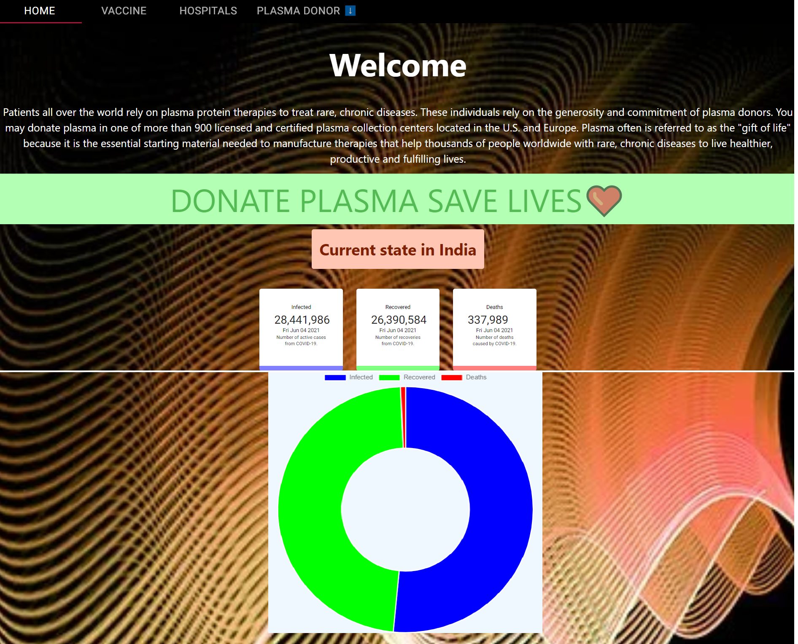
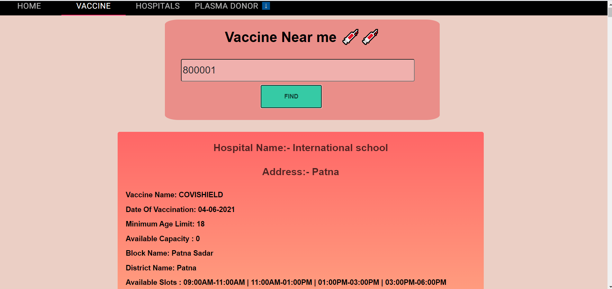
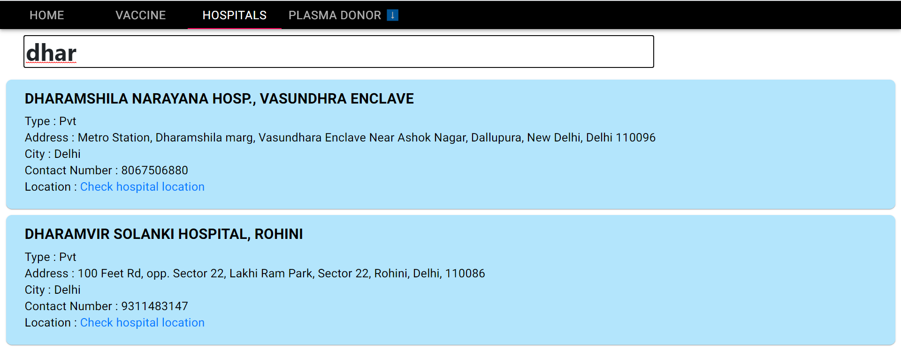
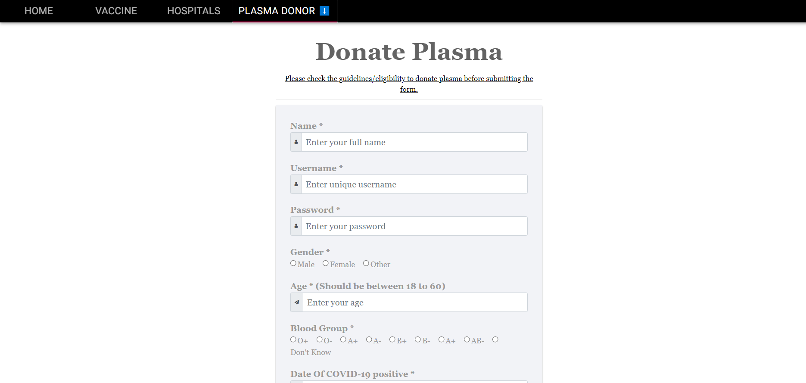
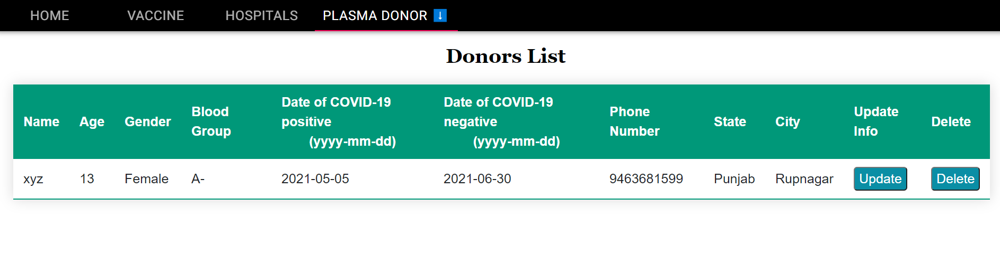
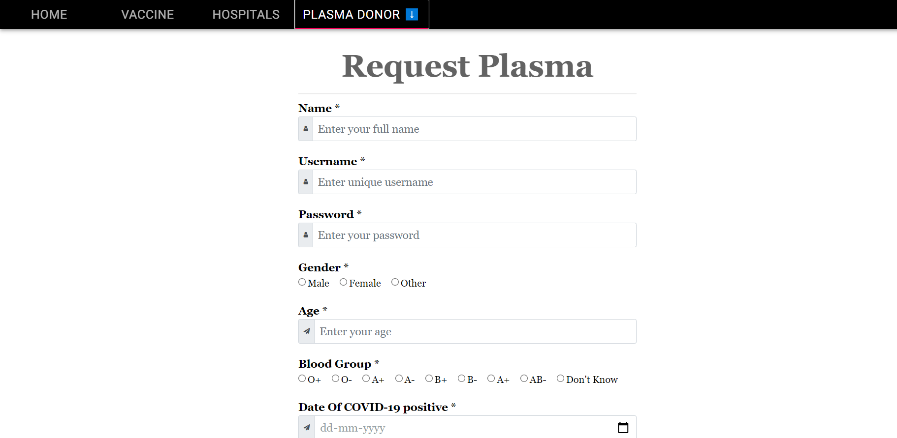
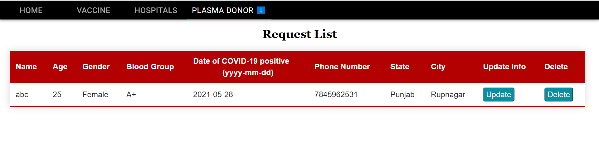

<h1>Hello 👋</h1>
Welcome to <b>Plasma Donation Website</b>. As we all know, the world is suffering from COVID-19 crisis. Our government and health care professionals are trying their best to help the  patients suffering from COVID-19. Scientists are trying to discover a vaccine to cure people affected with coronavirus. There is a scientific way from which we can help to lower the death ratio or help the COVID 19 affected person. Plasma therapy is an experimental approach to treat COVID positive patients and help them recover faster. But, in this situation it is difficult for a patient to find a plasma donor as everybody can’t donate plasma.
<h1>Our project goal</h1>
The main goal of our project is to make it easier for the COVID-19 patients to get a plasma donor easily as well as donate plasma if they have recovered. The system targets two types of user : the people who want to donate plasma and the people who need plasma.The user can also view the total active cases, nearby vaccine centres, hospitals address. The main objective for developing the website is to make it easier for the COVID-19 patients to get a plasma donor easily  and as soon as possible.
<h1>Work flow of the project</h1>
The person who wants to donate his/her plasma need to register in our application providing required information which are name, age, blood group, phone number and location etc.  
Patients who need plasma can also fill the form to request the plasma. Patients can directly call the donor by taking his/her contact number from the application .
The user can also view the total active cases, recovered cases, vaccine centres in their area,hospitals location and helpline number.

<h1>Technology Used</h1>
In this project, we have used the following technologies :-
<ul>
<li>Frontend : HTML, CSS, React.JS</li>
<li>Backend : NodeJs, Express.Js</li>
<li>Database : MongoDB</li>
</ul>
<h1>Screenshots & Gif</h1>
<h3> 1.) Home Page </h3>

<h3> 2.) Nearby Vaccine Centres </h3>

<h3> 3.) Hospitals List </h3>

<h3> 4.) Donor Form </h3>

<h3> 5.) Donors List </h3>

<h3> 6.) Request Form </h3>

<h3> 7.) Requests List </h3>

**Working Project Video:-** [Plasma Donation Website](https://drive.google.com/file/d/1EFCLIF-TqjJvc2h8EJK2Guxsn3IIA-px/view?usp=sharing)

## Contribute
**'' YOUR CONTRIBUTION MATTERS ''** 
As I am a student so I am not able to add too much functionality to this project. So, if you find any problem, bug (🐞), want to add more features to this website, or want to share any kind of suggestions to improve our work please let us know by creating an  [issue here](https://github.com/nehasoni05/Plasma_Donation_Website/issues). I will also try to work more on this project so I will host it somewhere and people find it useful.

## Future Work:-
1.) In future, we will try to verify the genuine users. 
2.) For now, we have just listed the hospitals in Delhi, but in the future, we will try to add hospitals of each state of India.
<h2>✨Team</h2>

<table>
  <tr>
    <td>
      <a href="https://github.com/nehasoni05">
       
        Neha Soni
      </a>
    </td>
    <td>
      <a href="https://github.com/AbhishekJaswal2001">
       
        Abhishek Jaswal
      </a>
    </td>
     <td>
     <a href="https://github.com/kritikakaura1518">
       
       Kritika Kaura
    </a>
    </td>
    <td>
     <a href="https://github.com/ridhisood04">
       
       Ridhi Sood
    </a>
    </td>
  </tr>
  
  </table>
<h3>If you like our work please give us a ⭐, it will motivate us to do more awesome work 😊</h3>

